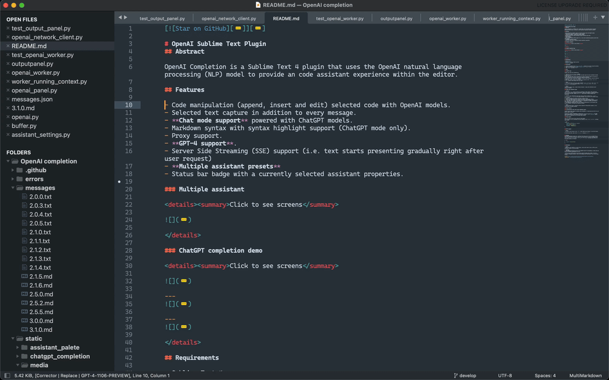

[![Star on GitHub][img-stars]][stars]

# OpenAI Sublime Text Plugin
## Abstract

OpenAI Completion is a Sublime Text 4 plugin that uses the OpenAI natural language processing (NLP) model to provide an code assistant experience within the editor.

## Features

- Code manipulation (append, insert and edit) selected code with OpenAI models.
- Selected text capture in addition to every message.
- **Chat mode support** powered with ChatGPT models.
- Markdown syntax with syntax highlight support (ChatGPT mode only).
- Proxy support.
- **GPT-4 support**.
- Server Side Streaming (SSE) support (i.e. text starts presenting gradually right after user request)
- **Multiple assistant presets**
- Status bar badge with a currently selected assistant properties.
- **Support for other OpenAI compatible APIs, like [Ollama](https://ollama.com/)**

### ChatGPT completion demo

<details><summary>Click to see screens</summary>


> gif is speed up 1.5x




> gif is speed up 1.5x

</details>

## Requirements

- Sublime Text 4
- [OpenAI](https://beta.openai.com/account) API key (paid service) or other OpenAI compatible API
- Internet connection (if using online service)

## Installation

1. Install the Sublime Text [Package Control](https://packagecontrol.io/installation) plugin if you haven't done this before.
2. Open the command palette and type `Package Control: Install Package`.
3. Type `OpenAI` and press `Enter`.

## Usage

### ChatGPT usage

ChatGPT mode works the following way:

1. Run the `OpenAI: New Message` command
2. Right after that the plug-in will open the output panel and start printing the model response into it.
3. Wait until the model stops transferring its answer (currently there's no way how to abort transmission or hide the output panel within that process).
4. If you would like to fetch chat history to another window manually, you can do that by running the `OpenAI: Refresh Chat` command.
5. When you're done or want to start all over you should run the `OpenAI: Reset Chat History` command, which deletes the chat cache.

> **Note**
>  You can bind both of the most usable commands `OpenAI: New Message` and `OpenAI: Show output panel`, to do that please follow `Settings` -> `Package Control` -> `OpenAI completion` -> `Key Bindings`.

> **Note**
> As for now there's just a single history instance. I guess this limitation would disappear sometime.

### Single shot completion usage

> **Warning**
> The `gpt-3.5-turbo` model can still be unreliable in this regard, often generating wordy responses despite specific instructions. OpenAI had promised to address this issue by the end of the year. However, the `gpt-4` model seems to handle commands more effectively.

0. Configure your assistant for each text task you wish to perform (e.g., `append`, `replace`, `insert`, `panel`) in the plugin settings. You can refer to the default setup as an example.
1. Launch the Sublime Text editor and select a block of code.
2. Access the command palette and execute the "OpenAI: New Message" command.
3. **The plugin will transmit the selected code to the OpenAI servers** using your API key. This action will prompt the generation of a suggested code modification based on your command (e.g., append, insert, or edit).
4. The suggestion provided will make the necessary modifications to the selected code within the editor, following the command you issued.

> **Note**
> A more detailed manual, including various assistant configuration examples, can be found within the plugin settings.

### Other features

### [Multi]Markdown syntax with syntax highlight support

ChatGPT output panel supports markdown syntax highlight. It should just work (if it's not please report an issue).

Although it's highly recommended to install the [`MultimarkdownEditing`](https://sublimetext-markdown.github.io/MarkdownEditing/) to apply syntax highlighting for code snippets provided by ChatGPT. `OpenAI completion` should just pick it up implicitly for the output panel content.

### Proxy support

That's it. Now you can set up a proxy for this plugin.
You can setup it up by overriding the proxy property in the `OpenAI completion` settings like follow:

```json
"proxy": {
    "address": "127.0.0.1", // required
    "port": 9898, // required
    "username": "account",
    "password": "sOmEpAsSwOrD"
}
```

### GPT-4 support

> **Note**
> You have to have access to the `GPT-4` model within your account, to use that feature.

It should just work, just set the `chat_model` setting to `GPT-4`.


## Settings
The OpenAI Completion plugin has a settings file where you can set your OpenAI API key. This is required for the plugin to work. To set your API key, open the settings within `Preferences` -> `Package Settings` -> `OpenAI` -> `Settings` and paste your API key in the token property, as follows:

```JSON
{
    "token": "sk-your-token",
}
```

### Setup alternative (OpenAI compatible) API
If using other LLM, that have OpenAI compatible API, like Ollama, you need to change some settings. First, you have to set correct `"url"` to point to API (for example `"http://localhost:11434"` for Ollama running on localhost). Then you have to set `"token"` (even if it is not required by API. It can be any string longer than 10 characters). And finally, tweak `"completions"` to use models, you want. Then everything should work just normal. 

## Disclaimers

> **Note**
> Please note that OpenAI is a paid service, and you will need to have an API key and sufficient credit to use this plugin if not using custom API provider.

> **Warning**
> **All selected code will be sent to the OpenAI servers (if not using custom API provider) for processing, so make sure you have all necessary permissions to do so**.

> This one was at 80% written by that thing itself including this readme. I was here mostly for debugging purposes, rather than designing and researching. This is pure magic, I swear.

[stars]: https://github.com/yaroslavyaroslav/OpenAI-sublime-text/stargazers
[img-stars]: static/media/star-on-github.svg
