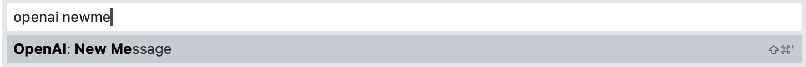
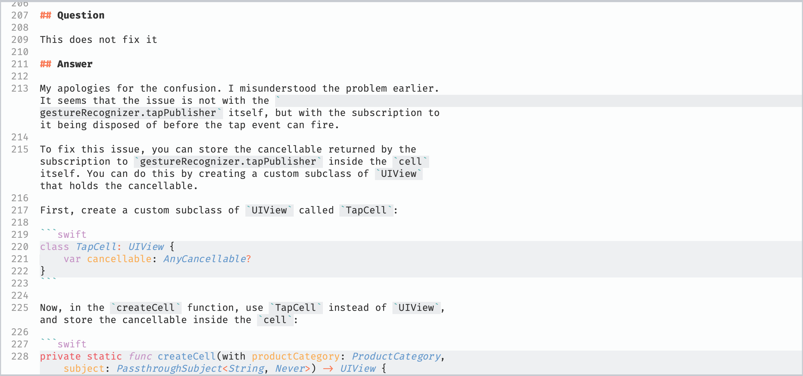
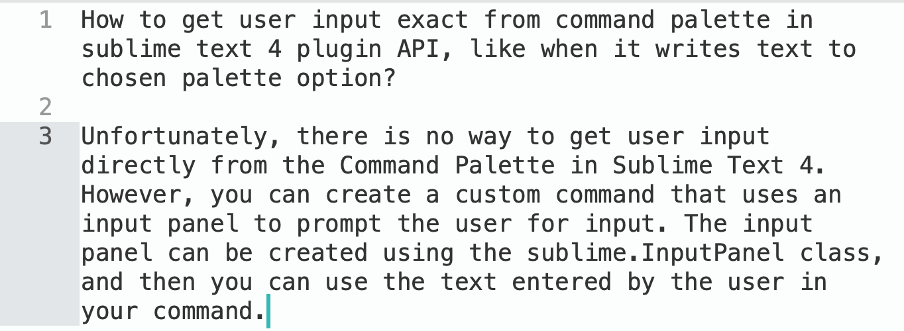
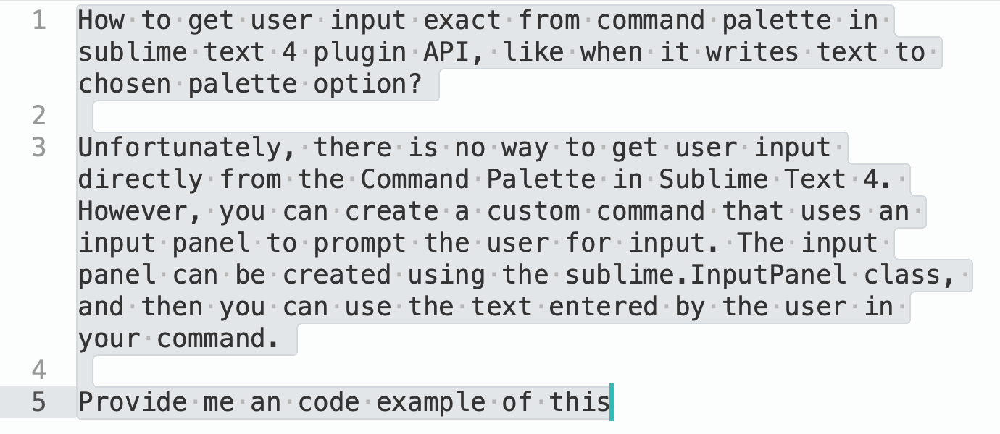

# OpenAI Sublime Text Plugin
## Abstract

OpenAI Completion is a Sublime Text 4 plugin that uses the OpenAI natural language processing (NLP) model to provide suggestions for editing code within the Sublime Text editor.

## Features
- Append suggested text to selected code
- Insert suggested text instead of placeholder in selected code
- Edit selected code according to a given command
- **ChatGPT mode support**.
- [Multi]Markdown syntax with syntax highlight support (ChatGPT mode only).
- Proxy support.
- **GPT-4 support**.
- Server Side Streaming (SSE) support

### ChatGPT completion demo

<details><summary>Click to see screens</summary>



---


---


</details>

### Simple completion demo

<details><summary>Click to see screens</summary>


---


---


---


</details>

## Requirements

- Sublime Text 4
- [OpenAI](https://beta.openai.com/account) API key (paid service)
- Internet connection

## Usage

### ChatGPT usage

ChatGPT mode works the following way:
1. Run the `OpenAI: New Message` command
2. Wait until OpenAI performs a response (be VERY patient in the case of the GPT-4 model it's way slower than you could imagine).
3. On the Response plugin opens the `OpenAI completion` output panel with the whole log of your chat at [any] active Window.
4. If you would like to fetch chat history to another window manually, you can do that by running the `OpenAI: Refresh Chat` command.
5. When you're done or want to start all over you should run the `OpenAI: Reset Chat History` command, which deletes the chat cache.

> **Note**
>  You can bind both of the most usable commands `OpenAI: New Message` and `OpenAI: Show output panel`, to do that please follow `Settings` -> `Package Control` -> `OpenAI completion` -> `Key Bindings`.

> **Note**
> As for now there's just a single history instance. I guess this limitation would disappear sometime.

### Single shot completion usage

1. Open the Sublime Text 4 editor and select some code.
2. Open the command palette and run the `OpenAI: Complete`, `OpenAI: Insert`, or `OpenAI: Edit` commands.
    - To use the `OpenAI: Insert` command, the selected code should include a placeholder `[insert]`. This can be modified in the settings.
3. **The plugin will send the selected code to the OpenAI servers**, using your API key, to generate a suggestion for editing the code.
4. The suggestion will modify the selected code in the editor, according to the command you ran (append, insert, or edit).

### Other features

### [Multi]Markdown syntax with syntax highlight support

ChatGPT output panel supports markdown syntax highlight. It should just work (if it's not please report an issue).

Although it's highly recommended to install the [`MultimarkdownEditing`](https://sublimetext-markdown.github.io/MarkdownEditing/) to apply syntax highlighting for code snippets provided by ChatGPT. `OpenAI completion` should just pick it up implicitly for the output panel content.

### Proxy support

That's it. Now you can set up a proxy for this plugin.
You can setup it up by overriding the proxy property in the `OpenAI completion` settings like follow:

```json
"proxy": {
    "address": "127.0.0.1",
    "port": 9898
}
```

### GPT-4 support

> **Note**
> You have to have access to the `GPT-4` model within your account, to use that feature.

It should just work, just set the `chat_model` setting to `GPT-4`. Please be patient while working with it. (1) It's **very** slow and (2) an answer would appear only after it finishes its prompt. It could take up to 10 seconds easily.


## Settings
The OpenAI Completion plugin has a settings file where you can set your OpenAI API key. This is required for the plugin to work. To set your API key, open the settings within `Preferences` -> `Package Settings` -> `OpenAI` -> `Settings` and paste your API key in the token property, as follows:

```JSON
{
    "token": "sk-your-token",
}
```

## Disclaimers

> **Note**
> Please note that OpenAI is a paid service, and you will need to have an API key and sufficient credit to use this plugin.

> **Warning**
> **All selected code will be sent to the OpenAI servers for processing, so make sure you have all necessary permissions to do so**.

> This one was at 80% written by that thing itself including this readme. I was here mostly for debugging purposes, rather than designing and researching. This is pure magic, I swear.
