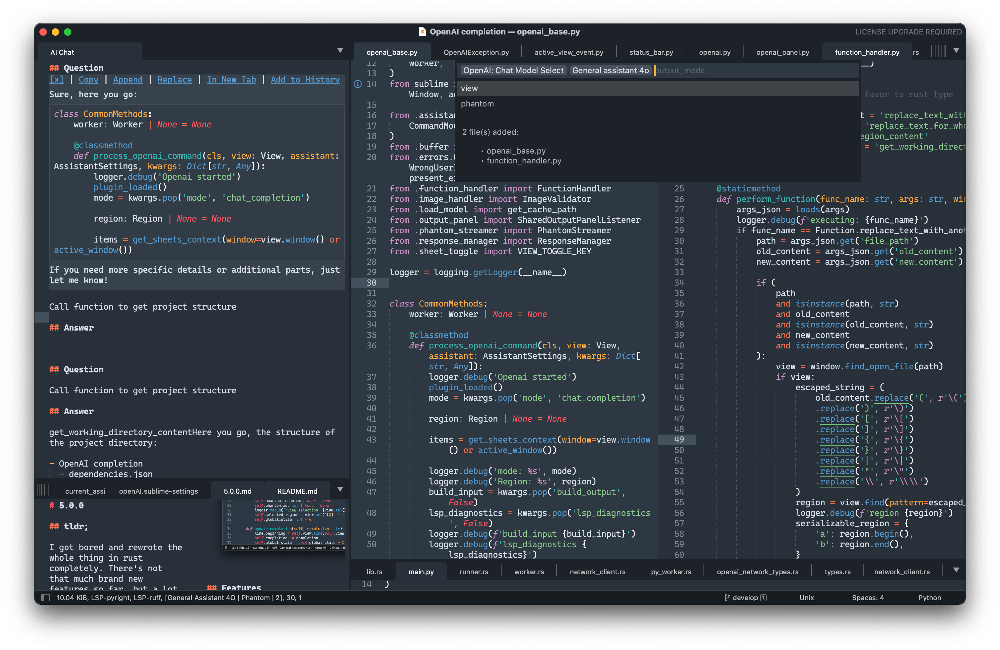
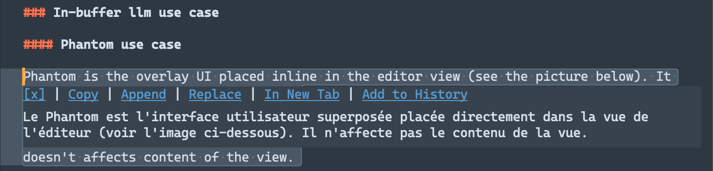

[![Star on GitHub][img-stars]][stars] ![Package Control][img-downloads]

# OpenAI Sublime Text Plugin
## tldr;

Cursor level of AI assistance for Sublime Text. I mean it.

Works with OpenAI Responses, Anthropic Claude, Google Gemini and the whole zoo of OpenAI-compatible APIs: [llama.cpp](https://github.com/ggerganov/llama.cpp) server, [ollama](https://ollama.com), [llmman](https://github.com/llmmanorg/llmman) or whatever third party LLM hosting you decided to trust today.




## Features

- **Chat mode** powered by whatever model you'd like.
- **gpt-5** support.
- **[llama.cpp](https://github.com/ggerganov/llama.cpp)**'s server, **[ollama](https://ollama.com)**, **[llmman](https://github.com/llmmanorg/llmman)** and all the rest OpenAI'ish API compatible.
- **Dedicated chats histories** and assistant settings for a projects.
- **Ability to send whole files** or their parts as a context expanding.
- **Phantoms** Get non-disruptive inline right in view answers from the model.
- Markdown syntax with code languages syntax highlight (Chat mode only).
- Server Side Streaming (SSE) streaming support.
- Status bar various info: model name, mode, sent/received tokens.
- Proxy support.

## Requirements

- Sublime Text build 4205 or newer (Python 3.14 plugin host)
- **llama.cpp**, **ollama**, **llmman** installed _OR_
- Remote llm service provider API key, e.g. [OpenAI](https://platform.openai.com)
- Optional [Anthropic](https://www.anthropic.com/api), [Google Gemini](https://ai.google.dev/) or other provider API key depending on your assistant setup.

Package Control keeps Sublime Text builds 4050–4204 on the frozen 6.1.0 /
Python 3.8-compatible release line.

## Installation

**Via Package Control**

1. Install the Sublime Text [Package Control](https://packagecontrol.io/installation) plugin if you haven't done this before.
2. Open the command palette and type `Package Control: Install Package`.
3. Type `OpenAI` and press `Enter`.

**Via Git Clone**

1. Go to your packages folder: `Preferences: Browse Packages`.
2. Run `git clone https://github.com/yaroslavyaroslav/OpenAI-sublime-text.git OpenAI\ completion` in that folder that Sublime opened.
3. Open Sublime Text and let it installed the dependencies.
4. It may ask you to restart Sublime, do that if it does.
5. Open Sublime again and type `OpenAI` and press `Enter`.

> [!NOTE]
> Highly recommended complimentary packages:
> - https://github.com/SublimeText-Markdown/MarkdownCodeExporter
> - https://sublimetext-markdown.github.io/MarkdownEditing

## Usage

### Interacting with the AI

You can interact with the AI in several ways, primarily through commands available in the Sublime Text Command Palette:

1.  **Select Text (Optional):** You can select a region of text in your current file to be included as part of the context for your prompt.
2.  **Choose Your Command:**
    *   **`OpenAI: Chat Model Select`**: This is the most flexible command. It opens a panel allowing you to:
        *   Choose a specific "assistant" (which defines the model, API key, temperature, etc.).
        *   Select an "output_mode" (inline `Phantom` or a chat `View` in a panel/new tab).
        This command automatically includes any files you've marked for context (see "Additional Request Context Management" below).
    *   **`OpenAI: New Message`**: This command sends your input directly using the assistant and output mode that were last selected or are currently active. It's quicker if you're consistently using the same settings. This command also includes any files marked for context.
3.  **Input Your Prompt:** A multiline input panel will appear, allowing you to type your question or instruction for the AI.
    * Press `Cmd+Enter` on macOS or `Ctrl+Enter` on Windows/Linux to submit.
    * Press `Esc` to close the panel and keep the current draft for the next time you open it.
    * At the first row and first column, press `Up` to browse older submitted prompts. While browsing history, press `Down` to move toward newer prompts and eventually restore the draft you started with.
    * Pasting with `Cmd+V` or `Ctrl+V` wraps clipboard text in a Markdown code block.
4.  **View Response:**
    *   The AI's response will typically appear in the OpenAI output panel.
    *   If you chose "Phantom" mode (with `OpenAI: Chat Model Select`), the response will appear as an inline overlay.
    *   You can switch to a dedicated tab for the chat using the `OpenAI: Open in Tab` command.

**Including Build/LSP Output:**
For more specific contexts, especially when coding, you can use commands that automatically include output from Sublime Text's diagnostic panels:
*   `OpenAI: New Message With Build Output`
*   `OpenAI: Chat Model Select With Build Output`
*   `OpenAI: New Message With LSP Output`
*   `OpenAI: Chat Model Select With LSP Output`

These commands will append recent lines from the respective output panels (Build results or LSP diagnostics) to your request. The number of lines included can be configured with the `build_output_limit` setting in `openAI.sublime-settings`. This is useful for asking the AI to explain errors, debug code, or summarize diagnostics.

**Managing Chat Sessions:**
*   **`OpenAI: Refresh Chat`**: Reloads the chat history into the output panel or tab.
*   **`OpenAI: Reset Chat History`**: Clears the chat history for the current context (project-specific or global).

### Chat section folding

Chat roles are rendered as hard-bounded Markdown sections such as `Question`,
`Selection`, and `Answer`. Configure section names to fold automatically in
`openAI.sublime-settings`; matching is case-insensitive and excludes the leading
Markdown hashes:

```json
{
    "fold_sections": ["Question", "Answer"]
}
```

Manual fold and unfold choices remain local to each chat view and survive
subsequent streaming updates.

### Chat history management

You can separate a chat history and assistant settings for a given project by appending the following snippet to its settings:

```json
{
    "settings": {
        "ai_assistant": {
            "cache_prefix": "/absolute/path/to/project/"
        }
    }
}
```

### Additional Request Context Management

You can include the content of specific files as context for the AI. Files marked for context will have their content sent along with your prompt. There are several ways to manage this:

*   **Using the Command Palette:**
    *   Run the `OpenAI: Add Sheets to Context` command. If you run this while one or more tabs are selected (e.g., using `Ctrl+Click` or `Cmd+Click` on tabs, or by selecting files in the sidebar that get focused as tabs), it will toggle their inclusion in the AI context.
*   **Using the Tab Context Menu:**
    *   Right-click on an open tab and select `OpenAI: Add File to Context` from the context menu to toggle its inclusion.
*   **Using the Sidebar Context Menu:**
    *   Right-click on a file or a selection of files in the sidebar and choose `OpenAI: Add File to Context` from the context menu to toggle their inclusion.

Once files are added to the context:
*   You can see the number of currently included sheets in the status bar (if this option is enabled in the `status_hint` setting).
*   The `OpenAI: Chat Model Select` command preview panel will also list the files currently included.
*   To view all files currently marked for context in the current window, run the `OpenAI: Show All Selected Sheets` command from the Command Palette. This will select these files in their respective views/groups.

Files can be deselected using the same methods (the commands effectively toggle the inclusion status).

### Image handling

Image handle can be called by `OpenAI: Handle Image` command.

It expects an absolute path to image to be selected in a buffer or stored in clipboard on the command call (smth like `/Users/username/Documents/Project/image.png`). In addition command can be passed by input panel to proceed the image with special treatment. `png` and `jpg` images are only supported.

> [!NOTE]
> Currently plugin expects the link or the list of links separated by a new line to be selected in buffer or stored in clipboard **only**.

### In-buffer llm use case

#### Phantom use case

Phantom is the overlay UI placed inline in the editor view (see the picture below). It doesn't affects content of the view.

1. [optional] Select some text to pass in context in to manipulate with.
2. Pick `Phantom` as an output mode in quick panel `OpenAI: Chat Model Select`.
3. After the AI responds, the phantom will display actions like:
    *   **[x] (Close):** Dismisses the phantom.
    *   **Copy:** Copies the AI's response (or just the code, if `phantom_integrate_code_only` is true) to the clipboard.
    *   **Append:** Appends the AI's response to the end of your current selection in the editor (or at the cursor position if no selection).
    *   **Replace:** Replaces your current selection with the AI's response.
    *   **In New Tab:** Opens the AI's full response in a new tab.
    *   **Add to History:** Saves the current interaction (your prompt and the AI's response) to the chat history panel/view.
4. You can hit `ctrl+c` to stop prompting same as with in `panel` mode.



### Other features

### Open Source models support (llama.cpp, ollama, llmman)

1. Replace `"url"` setting of a given model to point to whatever host you're server running on (e.g.`http://localhost:8080/v1/chat/completions`, or `http://localhost:17434/v1/chat/completions` for [llmman](https://github.com/llmmanorg/llmman)).
2. Provide a `"token"` if your provider required one.
3. Set `"api_type": "plain_text"` for older OpenAI-compatible hosts or `"api_type": "open_ai"` for modern chat-completions implementations.
4. Tweak `"chat_model"` to a model of your choice and you're set.

### Google Gemini models

1. Set `"url"` to the Gemini API root: `https://generativelanguage.googleapis.com/v1beta`.
2. Set `"api_type": "google"`.
3. Provide a `"token"` if your provider required one.
4. Tweak `"chat_model"` to [a model from the list of supported models](https://ai.google.dev/gemini-api/docs/models#model-variations).

### OpenAI Responses API

1. Set `"url"` to `https://api.openai.com/v1/responses`.
2. Set `"api_type": "open_ai_responses"`.
3. Use an OpenAI Responses-capable model such as `gpt-5`.

### Anthropic Claude models

1. Set `"url"` to `https://api.anthropic.com/v1/messages`.
2. Set `"api_type": "anthropic"`.
3. Provide your Anthropic API key as `"token"`.
4. Set `"chat_model"` to the Claude model you want to use.

> [!NOTE]
> You can set both `url` and `token` either global or on per assistant instance basis, thus being capable to freely switching between closed source and open sourced models within a single session.

## Settings

The OpenAI Completion plugin has a settings file where youcan set your OpenAI API key. This is required for the most of providers to work. To set your API key, open the settings with the `Preferences: OpenAI Settings` command and paste your API key in the token property, as follows: You can also access these settings and the default keybindings via the main menu: `Preferences -> Package Settings -> OpenAI completion`.

```json
{
    "token": "sk-your-token",
}
```

### Advertisement disabling

To disable advertisement you have to add `"advertisement": false` line into an assistant setting where you wish it to be disabled.

## Key Bindings

You can create custom keybindings for OpenAI commands by adding entries to your user keymap file. Access this file via the Command Palette (`Preferences: Key Bindings`) or the main menu (`Preferences -> Key Bindings`). Sublime Text keybindings often use sequences, for example, pressing `super+k` (or `ctrl+k` on Windows/Linux) followed by another key.

Here are some examples to get you started:

**1. New Message with current assistant (includes files marked for context):**
```json
{
    "keys": ["super+k", "m"], // macOS: Cmd+k, then m
    "command": "openai"
}
```

**2. Open Chat Model Select panel (includes files marked for context):**
```json
{
    "keys": ["super+k", "super+m"], // macOS: Cmd+k, then Cmd+m
    "command": "openai_panel"
}
```

**3. New Message with Build Output (using current assistant):**
```json
{
    "keys": ["super+k", "b"], // macOS: Cmd+k, then b
    "command": "openai",
    "args": { "build_output": true }
}
```

**4. Toggle current file's inclusion in AI Context (matches "OpenAI: Add Sheets to Context" command):**
```json
{
    "keys": ["super+k", "c"], // macOS: Cmd+k, then c
    "command": "toggle_view_ai_context_included"
}
```

**5. Show the AI Chat output panel:**
```json
{
    "keys": ["super+k", "p"], // macOS: Cmd+k, then p
    "command": "show_panel",
    "args": { "panel": "output.AI Chat" }
}
```

### Proxy support

You can setup it up by overriding the proxy property in the `OpenAI completion` settings like follow:

```js
"proxy": {
    "address": "127.0.0.1", // required
    "port": 9898, // required
    "username": "account",
    "password": "sOmEpAsSwOrD"
}
```

## Development

### Shared chat UI

Panel primitives and the fixed Chat Markdown syntax are vendored from the
public [`sublime-chat-ui`](https://github.com/yaroslavyaroslav/sublime-chat-ui)
source repository. Edit that repository, then update this read-only subtree
with:

```bash
./scripts/update_sublime_chat_ui.sh <ref>
```

Set `SUBLIME_CHAT_UI_REPO` to a local clone path to pull unpushed development
branches.

## Disclaimers

> [!WARNING]
> All selected code will be sent to the OpenAI servers (if not using custom API provider) for processing, so make sure you have all necessary permissions to do so.

> [!NOTE]
> Dedicated to GPT3.5 that one the one who initially written at 80% of this back then. This was felt like a pure magic!

[^1]: PR's are welcome tho.

[stars]: https://github.com/yaroslavyaroslav/OpenAI-sublime-text/stargazers
[img-stars]: static/media/star-on-github.svg
[downloads]: https://packagecontrol.io/packages/OpenAI%20completion
[img-downloads]: https://img.shields.io/packagecontrol/dt/OpenAI%2520completion.svg
