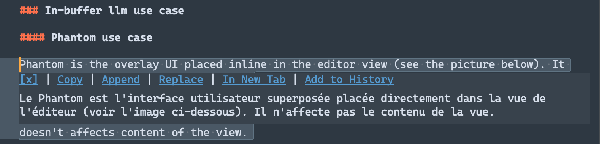

[![Star on GitHub][img-stars]][stars] ![Package Control][img-downloads]

> [!WARNING]
> Package Control do not fetches any updates for a two weeks for now and there's nothing I can do with that, so if you want to use the latest version of this package you have to clone it and install it manually.

# OpenAI Sublime Text Plugin
## tldr;

Cursor level of AI assistance for Sublime Text. I mean it.

Works with all OpenAI'ish API: [llama.cpp](https://github.com/ggerganov/llama.cpp) server, [ollama](https://ollama.com) or whatever third party LLM hosting. Claude API support coming soon.

> [!NOTE]
> 5.0.0 release is around the corner! Check out [release notes](https://github.com/yaroslavyaroslav/OpenAI-sublime-text/blob/develop/messages/5.0.0.md) for details.


## Features

- **Chat mode** powered by whatever model you'd like.
- **o3-mini** and **o1** support.
- **gpt-4.5-preview** support
- **[llama.cpp](https://github.com/ggerganov/llama.cpp)**'s server, **[ollama](https://ollama.com)** and all the rest OpenAI'ish API compatible.
- **Dedicated chats histories** and assistant settings for a projects.
- **Ability to send whole files** or their parts as a context expanding.
- **Phantoms** Get non-disruptive inline right in view answers from the model.
- Markdown syntax with code languages syntax highlight (Chat mode only).
- Server Side Streaming (SSE) streaming support.
- Status bar various info: model name, mode, sent/received tokens.
- Proxy support.

## Requirements

- Sublime Text 4
- **llama.cpp**, **ollama** installed _OR_
- Remote llm service provider API key, e.g. [OpenAI](https://platform.openai.com)
- Atropic API key [coming soon].

## Installation

1. Install the Sublime Text [Package Control](https://packagecontrol.io/installation) plugin if you haven't done this before.
2. Open the command palette and type `Package Control: Install Package`.
3. Type `OpenAI` and press `Enter`.

> [!NOTE]
> Highly recommended complimentary packages:
> - https://github.com/SublimeText-Markdown/MarkdownCodeExporter
> - https://sublimetext-markdown.github.io/MarkdownEditing

## Usage

### AI Assistance use case

ChatGPT mode works the following way:

0. Select some text or even the whole tabs to include them in request
1. Run either `OpenAI: Chat Model Select` or `OpenAI: Chat Model Select With Tabs` commands.
2. Input a request in input window if any.
3. The model will print a response in output panel by default, but you can switch that to a separate tab with `OpenAI: Open in Tab`.
4. To get an existing chat in a new window run `OpenAI: Refresh Chat`.
5. To reset history `OpenAI: Reset Chat History` command to rescue.

> [!NOTE]
>  You suggested to bind at least `OpenAI: New Message`, `OpenAI: Chat Model Select` and `OpenAI: Show output panel` in sake for convenience, you can do that in plugin settings.

### Chat history management

You can separate a chat history and assistant settings for a given project by appending the following snippet to its settings:

```json
{
    "settings": {
        "ai_assistant": {
            "cache_prefix": "/absolute/path/to/project/"
        }
    }
}
```

### Additional request context management

You can add a few things to your request:
- multi-line selection within a single file
- multiple files within a single View Group

To perform the former just select something within an active view and initiate the request this way without switching to another tab, selection would be added to a request as a preceding message (each selection chunk would be split by a new line).

To append the whole file(s) to request you should `super+button1` on them to make whole tabs of them to become visible in a **single view group** and then run `OpenAI: Add Sheets to Context` command. Sheets can be deselected with the same command.

You can check the numbers of added sheets in the status bar and on `"OpenAI: Chat Model Select"` command call in the preview section. 


### Image handling

Image handle can be called by `OpenAI: Handle Image` command.

It expects an absolute path to image to be selected in a buffer or stored in clipboard on the command call (smth like `/Users/username/Documents/Project/image.png`). In addition command can be passed by input panel to proceed the image with special treatment. `png` and `jpg` images are only supported.

> [!NOTE]
> Currently plugin expects the link or the list of links separated by a new line to be selected in buffer or stored in clipboard **only**.

### In-buffer llm use case

#### Phantom use case

Phantom is the overlay UI placed inline in the editor view (see the picture below). It doesn't affects content of the view.

1. [optional] Select some text to pass in context in to manipulate with.
2. Pick `Phantom` as an output mode in quick panel `OpenAI: Chat Model Select`.
3. You can apply actions to the llm prompt, they're quite self descriptive and follows behavior deprecated in buffer commands.
4. You can hit `ctrl+c` to stop prompting same as with in `panel` mode.



### Other features

### Open Source models support (llama.cpp, ollama)

1. Replace `"url"` setting of a given model to point to whatever host you're server running on (e.g.`http://localhost:8080/v1/chat/completions`).
2. Provide a `"token"` if your provider required one.
3. Tweak `"chat_model"` to a model of your choice and you're set.

> [!NOTE]
> You can set both `url` and `token` either global or on per assistant instance basis, thus being capable to freely switching between closed source and open sourced models within a single session.

## Settings

The OpenAI Completion plugin has a settings file where you can set your OpenAI API key. This is required for the most of providers to work. To set your API key, open the settings within `Preferences` -> `Package Settings` -> `OpenAI` -> `Settings` and paste your API key in the token property, as follows:

```json
{
    "token": "sk-your-token",
}
```

### Advertisement disabling

To disable advertisement you have to add `"advertisement": false` line into an assistant setting where you wish it to be disabled.

## Key bindings

You can bind keys for a given plugin command in `Preferences` -> `Package Settings` -> `OpenAI` -> `Key Bindings`. For example you can bind "New Message" including active tabs as context command like this:

```js
{
    "keys": [ "super+k", "super+'" ],
    "command": "openai", // or "openai_panel"
    "args": { "files_included": true }
},
```

### Proxy support

You can setup it up by overriding the proxy property in the `OpenAI completion` settings like follow:

```js
"proxy": {
    "address": "127.0.0.1", // required
    "port": 9898, // required
    "username": "account",
    "password": "sOmEpAsSwOrD"
}
```

## Disclaimers

> [!WARNING]
> All selected code will be sent to the OpenAI servers (if not using custom API provider) for processing, so make sure you have all necessary permissions to do so.

> [!NOTE]
> Dedicated to GPT3.5 that one the one who initially written at 80% of this back then. This was felt like a pure magic!

[stars]: https://github.com/yaroslavyaroslav/OpenAI-sublime-text/stargazers
[img-stars]: static/media/star-on-github.svg
[downloads]: https://packagecontrol.io/packages/OpenAI%20completion
[img-downloads]: https://img.shields.io/packagecontrol/dt/OpenAI%2520completion.svg
